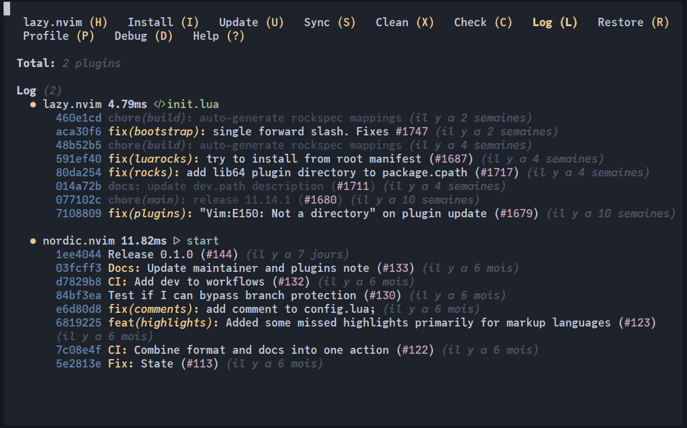

# Lazy.nvim

- [Documentation](https://lazy.folke.io/)
- [Page GitHub](https://github.com/folke/lazy.nvim) de **lazy.nvim**
- Un fork de **lazy.nvim** : [LazyVim](https://www.lazyvim.org/)

 

## Mais qu'est-ce donc ?

**Lazy.nvim** est un gestionnaire de *plugins* moderne pour *NeoVim*, conçu pour être rapide, efficace et facile à utiliser. Il permet de charger les *plugins* de manière paresseuse (*lazy loading*), ce qui signifie que les *plugins* ne sont chargés que lorsqu'ils sont réellement nécessaires. Cela améliore les performances de démarrage de *NeoVim* et réduit la consommation de mémoire. **Lazy.nvim** offre également une syntaxe simple et intuitive pour définir et configurer les *plugins*, facilitant ainsi la gestion et la personnalisation de votre environnement de développement. Outre le fait qu'il n'y a donc pas nécessité de compiler les *plugins* pour les installer, il est à noter un séquencement efficace des dépendances. Une trace des *plugins* installés est conservé dans un fichier de verrouillage (`lazy-lock.json`).

A noter que si un *plugin A*, chargé de manière paresseuse, et que si un *plugin B* nécessite un module du *plugin A*, alors le *plugin A* sera chargé à la demande comme prévu.

## Installation & configuration (cf. [configuration par défaut](https://lazy.folke.io/configuration))

Il est recommandé d'en passer par une installation structurée, plutôt que d'en passer par une installation dans un fichier unique comme le fichier `init.lua` (cf. infra : la configuration). Après l'installation, exécuter la commande : `:checkhealth lazy`.

Pour installer **Lazy.nvim**:

Dans `init.lua`:
```lua
require("config.lazy")
```

Dans `lua/config/lazy.lua`:
```lua
local lazypath = vim.fn.stdpath "data" .. "/lazy/lazy.nvim" 
local lazyrepo = "https://github.com/folke/lazy.nvim.git"
local uv = vim.uv  

if not uv.fs_stat(lazypath) then  
  vim.fn.system { 
    "git",
    "clone",
    "--filter=blob:none",  
    "--branch=stable", 
    lazyrepo,
    lazypath,
  }
end

vim.opt.rtp:prepend(lazypath)

require("lazy").setup({
  spec = {
    import = "plugins",
  },
  checker = { 
    enabled = true,  
  },
})
```

## Utilisation

Eléments de configuration à insérér dans le fichier `plugins.lua`.

### Spécifications des plugins

Des propriétés permettent de définir de manière flexible et personnalisée les plugins que l'on souhaite gérer avec **lazy.nvim**, par l'utilisation d'URL courtes, de répertoires locaux, d'URL personnalisées, de noms personnalisés, et même configurer des plugins en mode développement local. Cela offre une grande flexibilité pour gérer des plugins de manière adaptée à ses besoins (https://lazy.folke.io/spec#spec-source).

Exemples :
```lua
-- Utilisation de l'URL courte :
{
  'folke/lazy.nvim',
  lazy = true,
  config = function()
    require('lazy').setup()
  end,
}

-- Utilisation d'un répertoire local: :
{
  dir = '/path/to/local/plugin',
  lazy = true,
  config = function()
    require('local_plugin').setup()
  end,
}

-- Utilisation d'une URL personnalisée :
{
  url = 'https://github.com/user/plugin.git',
  lazy = true,
  config = function()
    require('plugin').setup()
  end,
}

-- Utilisation d'un nom personnalisé :
{
  'folke/lazy.nvim',
  name = 'my-custom-lazy',
  lazy = true,
  config = function()
    require('lazy').setup()
  end,
}
```

Des propriétés pour contrôler le chargement et le comportement des plugins (cf. [spec Loading](https://lazy.folke.io/spec#spec-loading)) :
- `dependencies` : Une liste de noms de *plugins* ou de spécifications de *plugins* qui doivent être chargés lorsque le *plugin* principal est chargé. Les dépendances sont toujours chargées de manière paresseuse (*lazy-loaded*) sauf si spécifié autrement (s'assurer que la spécification du plugin a été définie ailleurs). 
- `enabled` : Lorsque cette propriété est définie sur `false` alors ce *plugin* ne sera pas inclus dans la spécification.
- `cond` : Cette propriété se comporte de la même manière que `enabled`, mais elle ne désinstallera pas le *plugin* lorsque la condition est `false`.
- `priority` : Cette propriété est utile uniquement pour les *plugins* de démarrage (`lazy=false`) pour forcer le chargement de certains *plugins* en premier. La priorité par défaut est 50. Il est recommandé de définir cette propriété à un nombre élevé pour les thèmes de couleurs.

Des propriétés pour configurer et initialiser les *plugins* (cf. [spec Setup](https://lazy.folke.io/spec#spec-setup)):
- `init` : Cette propriété est utilisée pour définir des configurations globales qui doivent être exécutées au démarrage de *Neovim*.
- `opts` : Cette propriété est utilisée pour définir les options de configuration du *plugin*. Elle peut être un tableau ou une fonction retournant un tableau. Les options seront passées à la fonction `Plugin.config()`.
- `config` : Cette propriété est utilisée pour définir la fonction de configuration du *plugin*. Elle est exécutée lorsque le *plugin* est chargé. L'implémentation par défaut exécutera automatiquement `require(MAIN).setup(opts)` si `opts` ou `config = true` est défini.
- `main` : Cette propriété permet de spécifier le module principal à utiliser pour `config()` et `opts()`, au cas où il ne peut pas être déterminé automatiquement.
- `build` : Cette propriété est utilisée pour définir les commandes de *build* à exécuter lorsque le *plugin* est installé ou mis à jour.
Il est recommandé d'utiliser `opts` au lieu de `config` lorsque cela est possible.

Des propriétés à utiliser pour configurer le chargement paresseux (*lazy loading*) des *plugins* (cf. [Spec Lazy Loading](https://lazy.folke.io/spec#spec-setup)) :
- `lazy` : Cette propriété permet de spécifier que le *plugin* doit être chargé de manière paresseuse. Lorsque `lazy` est défini sur `true`, le *plugin* ne sera chargé que lorsqu'il est nécessaire.
- `event` : Cette propriété permet de spécifier des événements qui déclencheront le chargement paresseux du *plugin*. Les événements peuvent être spécifiés directement ou avec des motifs.
- `cmd` : Cette propriété permet de spécifier des commandes qui déclencheront le chargement paresseux du *plugin*.
- `ft` : Cette propriété permet de spécifier des types de fichiers qui déclencheront le chargement paresseux du *plugin*.
- `keys` : Cette propriété permet de spécifier des combinaisons de touches qui déclencheront le chargement paresseux du *plugin*.

Des propriétés à utiliser pour spécifier la version d'un *plugin* à installer ou à mettre à jour (cf. [Spec Versioning](https://lazy.folke.io/spec#spec-setup) et la page consacrée au [*versioning*](https://lazy.folke.io/spec/versioning)) :
- `branch` : Cette propriété permet de spécifier une branche spécifique du dépôt Git à partir de laquelle le *plugin* doit être installé.
- `tag` : Cette propriété permet de spécifier un *tag* spécifique du dépôt Git à partir duquel le *plugin* doit être installé.
- `commit` : Cette propriété permet de spécifier un *commit* spécifique du dépôt Git à partir duquel le *plugin* doit être installé.
- `version` : Cette propriété permet de spécifier une version spécifique à utiliser à partir du dépôt.
- `pin` : Cette propriété permet de "fixer" le *plugin* à une version spécifique et d'empêcher les mises à jour automatiques.
- `submodules` : Cette propriété permet de contrôler si les sous-modules Git doivent être récupérés ou non. Par défaut, les sous-modules sont récupérés.
 
Des propriétés avancées (cf. [Spec Advanced](https://lazy.folke.io/spec#spec-advanced) :
- `optional` : Cette propriété permet de marquer un *plugin* comme optionnel.
- `specs` : Cette propriété permet de définir une liste de spécifications de *plugins* dans le contexte du *plugin*.    
- `module` : Cette propriété permet de contrôler si un module Lua doit être automatiquement chargé lorsqu'il est requis ailleurs.
- `import` : Cette propriété permet d'importer un module de spécification donné.

### Séquence de démarrage

*lazy.nvim* n'utilise **PAS** les paquets *Neovim* et désactive même complètement le chargement des *plugins*. C'est donc *lazy.nvim* qui prend en charge toute la séquence de démarrage pour plus de flexibilité et de meilleures performances.

En pratique, cela signifie qu'une des étapes de l'initialisation de *Neovim* est effectuée par *Lazy* :
- Toutes les fonctions `init()` des *plugins* sont exécutées
- Tous les *plugins* avec `lazy=false` sont chargés.
- Tous les fichiers des répertoires `/plugin` et `/ftdetect` de votre *rtp* sont sourcés.
- Tous les fichiers `/after/plugin` sont sourcés (y compris `/after` des *plugins*).

Les fichiers des répertoires d'exécution sont toujours sourcés dans l'ordre alphabétique.

### L'interface de **Lazy**

Commande pour ouvrir l'interface : `:Lazy`

Se positionner sur le nom du *plugin* et taper **<ENTREE>** donne des informations sur le *plugin*. Presser **<K>** ouvre la page *GitHub* du *plugin* (cf. `:Lazy help` ou **<?>** pour ouvrir l'aide de **Lazy**).

- **I**nstall : installe les *plugins* manquants.
- **U**pdate : met à jour les *plugins*, ainsi que le fichier de verrouillage.
- **S**ync : exécute l'installation, le nettoyage et la mise à jour .
- **X** clean : nettoyer les *plugins* qui ne sont plus nécessaires.
- **C**heck : vérification des mises à jour et affichage les *logs*.
- **L**og : affiche les mises à jour récentes.
- **R**estore : mise à jour des *plugins* à l'état du fichier de vérouillage.
- **P**rofile : affiche un profilage détaillé de **Lazy** (pourquoi et combien de temps pour charger les *plugins*).
- **D**ebug : affiche les informations de débogage.

Autres commandes :
- `:Lazy health` : vérifie l'état de **Lazy**.
- `:Lazy home` : retourne à la liste des *plugins*.

### Fichier de vérouillage

Après chaque mise à jour, le fichier de verrouillage local (`lazy-lock.json`) est mis à jour avec les révisions installées. Il est recommandé d'avoir ce fichier sous contrôle de version.


