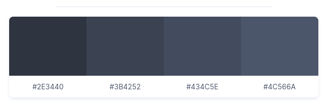
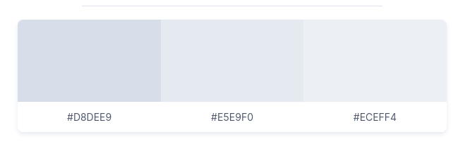
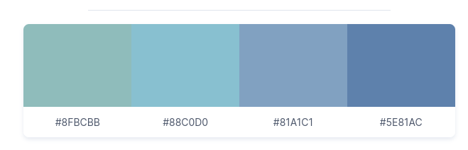
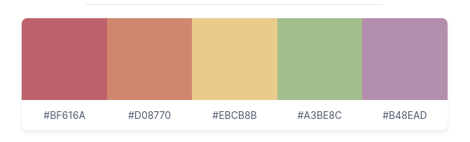

# nordic

- [GitHub](https://github.com/AlexvZyl/nordic.nvim)

Un thème de couleurs *Neovim* basé sur [Nord](https://www.nordtheme.com/) mais avec un jeu de couleurs plus sombres en utilisant *Aurora* de façon plus importante, offrant ainsi des couleurs plus douces pour les yeux.

## Installation

Dans `~/.config/nvim/lua/plugins.lua` :
```lua
{
  'AlexvZyl/nordic.nvim',
  lazy = false,
  priority = 1000, -- Pour être sûr qu'il soit le premier chargé
  branch = 'main',
  config = function ()
	require(config_plug .. "nordic")
end,
}
```

----

Le thème *nordic* use d'une palette de couleurs dites arctiques et bleutées, créé pour la mise en évidence de la syntaxe du code et les composants de l'interface utilisateur.

*Nord* se compose de quatre palettes de couleurs nommées qui offrent des significations syntaxiques et des effets de couleurs différents pour les conceptions d'ambiances sombres et lumineuses :
- *Polar Night*

- *Snow Storm*

- *Frost*

- *Aurora*


